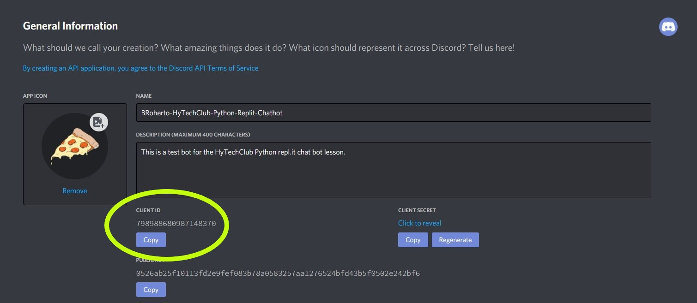
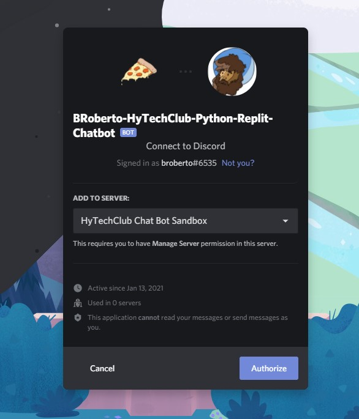

# Discord Chat Bot

In this activity, create a Discord chat bot that can respond to messages in a Discord server. How the chat bot responds and what it says is for you to decide! The chat bot could respond to common phrases, or respond to commands with useful features like rolling dice, posting pictures, or acting as a calculator.

## Setting Up

1. Go to [repl.it](https://repl.it)
1. Log in
1. Clone the [HyTechClub-Robot-Start repl](https://repl.it/@brebory/HyTechClub-Robot-Start)
1. Make sure you have a Discord account so you can create and register your bot

## Creating and Registering the Bot

The first step is to navigate to the [Discord Developer Portal](https://discord.com/developers/applications). You'll be prompted to log in, so use your Discord account that you created during set up.

1. Make sure that you're on the Applications tab, and then click the blue "New Application" button in the top right
1. The "Create An Application" dialog will appear, so give your appliction a name, then click Create
1. You will be taken to your new application's General Information page. In the left-hand sidebar, click on "Bot"
1. On the Bot page, click the "Add Bot" button

If you get an error about "Too many users share this name", then you will need to change your application's name on the General Information page first, then try again with the new name.

## Saving the Bot Token in the .env File

Repl.it has a special feature that allows you to create environment variables for your Repl application. In your Repl, create a new file called `.env`. In this plaintext file, you can create environment variables by making key-value pairs like this:

```text
ENVIRONMENT_VARIABLE_NAME=Value
ANOTHER_VARIABLE=anothervalue
```

Each environment variable should be on it's own line within this file.

1. In the .env file, create a new variable called `DISCORD_BOT_SECRET`
1. Back in the Discord Developer Portal, navigate to your Bot's page, and find the "Copy" button for your bot's "Token"

1. Click the copy button and paste the Bot Token into your Repl's `.env` file

### Code

```text
DISCORD_BOT_SECRET=ABCD.EFGHIJKLMNOPQR.STUVWXYZ
```

## Adding the Bot to the Sandbox Server

1. If you haven't already created a Discord account, you'll need to for this step
1. Join the [Hy-Tech Club Chat Bot Sandbox](https://discord.gg/7VUAKkHEvm)
1. In the `#welcome` channel, click the beaker reaction on MEE6's message to give yourself the Bot Tester role
1. Copy the "Client ID" from your Discord Application

1. Invite your bot to the Sandbox server
1. Use the following link format, but replace the `client_id` url parameter with your application's client id
https://discord.com/oauth2/authorize?client_id=xxxxxx&scope=bot


## Testing the Bot

With the starter code from the Repl, your Bot Token in the `.env` file, and your Bot added to the Hy-Tech Club Bot Testing Sandbox, you should now be able to run your Repl and see your bot successfully log in! Click the Run button at the top of the repl and you should see output similar to the following, except the username should match the username that you gave your bot. Additionally, in the list of users for the Hy-Tech Club Bot Testing Sandbox, your bot should appear as online.

```text
Logged in as: HyTechClub Robot#9248
Command prefix is: !
```

## Using the discord.py Library

For the rest of the lesson, we will be using the [discord.py](https://pypi.org/project/discord.py/) library. [Repl.it](https://repl.it) automatically handles downloading the library for you when you `import` it, thanks to the [Poetry Package Manager](https://python-poetry.org). When you run your Repl, you will see output similar to the following:

```text
Repl.it: Updating package configuration

--> python3 -m poetry install
Installing dependencies from lock file


Package operations: 2 installs, 2 updates, 0 removals

  - Updating idna (2.10 -> 3.1)
  - Updating chardet (4.0.0 -> 3.0.4)
  - Installing discord.py (1.6.0)
  - Installing discord (1.0.1)
```

You will want to reference the [documentation for the discord.py library](https://discordpy.readthedocs.io/en/latest/) while following this code-along, and you will also need to look up features from this library when completing the challenges for this lesson, so keep it open in another tab for reference.

## Review the Repl's Starting Code

Let's break down the starting code from the [HyTechClub-Robot-Start repl](https://repl.it/@brebory/HyTechClub-Robot-Start).

### Imports and Initialization

```py
from discord.ext.commands import Bot
import os

bot = Bot(command_prefix = "$")
```

This code imports the [`Bot`](https://discordpy.readthedocs.io/en/latest/ext/commands/api.html#bots) class from the discord.ext.commands library, as well as the os package. Then, a new bot is created by calling the `Bot` constructor, providing a default `command_prefix`, and saving the result in the `bot` variable.

### The on_ready Event

Next, the starter code defines an `on_ready` event handler. Event handlers allow you to write code that executes in response to something that happens, also known as events. You can view a reference of all of the events supported by the [discord.py](https://pypi.org/project/discord.py/) library [here](https://discordpy.readthedocs.io/en/latest/api.html#event-reference). In this code-along, we will focus on the `on_ready` and `on_message` events, but there are many other events your bot could handle.

```py
@bot.event
async def on_ready():
  print("Logged in as: {}".format(bot.user))
  print("Command prefix is: {}".format(bot.command_prefix))
```

This code registers the `on_ready` event for the `bot`, with a simple implementation that prints the bot's username and tag, as well as the command prefix when the bot starts. This is helpful to verify that the bot was able to start successfully.

Note that the `on_ready` function is `async`, which means that the function is a [coroutine](https://www.python.org/dev/peps/pep-0492). You don't need to understand all the details about coroutines - just know that making a function a codroutine allows it to be scheduled in an *event loop*. This allows your code to respond to real-time events.

All of the functions we create as event handlers must be defined as coroutines.

### Starting the Bot

```py
token = os.environ.get("DISCORD_BOT_SECRET")
bot.run(token)
```

This code reads the `DISCORD_BOT_SECRET` token you set up earlier as an environment variable (through `.env` file feature on Repl.it) using the [`os.environ`](https://docs.python.org/3/library/os.html#os.environ) dictionary. Then, it passes the token to the bot and runs it, which starts the bot and logs it in to Discord.

## Responding to the on_message Event

The next step is to allow your bot to respond to messages in servers that it has joined. In order to accomplish this, you will use the `@bot.event` decorator. This decorator will take a function and add it to your bot as an "event handler". The event that the handler responds to is drawn from the function name, so the function `on_message` will respond to the [`on_message`](https://discordpy.readthedocs.io/en/latest/api.html#discord.on_message) event.

1. Define an async function called `on_message`
1. Add the `@bot.event` decorator above your new `on_message` function
1. Add one parameter to your `on_message` function, called `message`
1. For now, give your function an empty body, using the `pass` keyword

### Code

```py
@bot.event
async def on_message(message):
  pass
```

## Limiting the Bot's Responses

The first thing your bot should do is *not respond to other bots*. With all the other students working on bots at the same time, things could get a bit crazy if all the bots would respond to each other, or even themselves! You will achieve this by using properties from discord\.py's [`Message`](https://discordpy.readthedocs.io/en/latest/api.html#message) and [`User`](https://discordpy.readthedocs.io/en/latest/api.html#user) classes. Specifically, the `message.author` property, and the `user.bot` property will allow you to verify whether or not a particular message was sent by a bot.

1. Remove the `pass` keyword in your `on_message` function
1. Add an `if` statement inside the `on_message` function
1. As the condition for the if statement, check properties of the `message` parameter: `message.author.bot`
1. Add the colon to denote the start of the `if` statement body
1. On the next line, add an empty `return`

### Code

```py
@bot.event
async def on_message(message):
  if message.author.bot:
    return
```

## Logging Received Messages

Currently, the `on_message` event handler doesn't have any visible side effects, so it's not easy to test if it's working correctly. Let's add a log message so we can tell when the Bot is handling messages.

1. Under the if statement within the `on_message` function, add a print statement
1. Print a message that logs both the `message.author` and `message.content` from the received message.

### Code

```py
print("Received message: {} > {}".format(message.author, message.content))
```

## Adding the Ping Pong Response

Ok, so the Bot currently writes to your Repl's console, but the whole point of the Chat Bot is to send messages in the Discord server! Let's get the Bot to respond to a simple prompt. When anyone says "ping", the bot should respond with "pong". Or, if you're feeling creative, add any other simple call-and-response you want, like "Marco" "Polo" or anything else you like.
